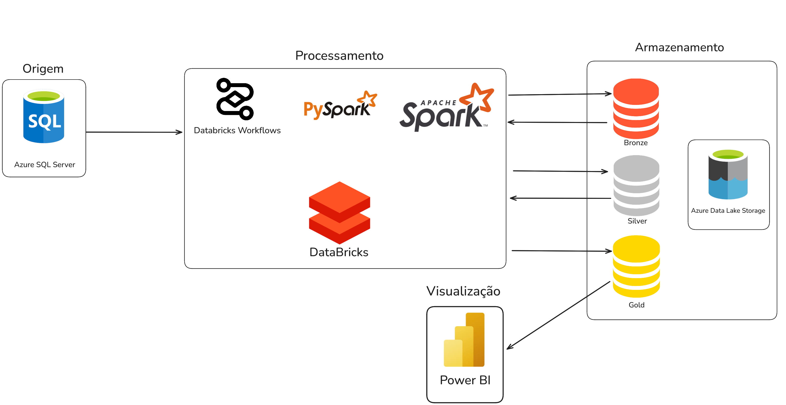

## Projeto final de Engenharia de Dados - SATC


### Introdução

Este documento descreve o projeto final da matéria de Engenharia de Dados na faculdade UniSatc.


### Desenho de Arquitetura



### Pré-requisitos
* [Python 3.12.6](https://www.python.org/downloads/release/python-3126/)

* [Criar uma conta na Azure](https://azure.microsoft.com/en-us/)

* [Azure CLI](https://learn.microsoft.com/en-us/cli/azure/install-azure-cli)

* [Docker](https://docs.docker.com/engine/install/)  

* [Terraform](https://developer.hashicorp.com/terraform/tutorials/aws-get-started/install-cli)


### Instalação
#### Python Gerador de dados
Em [notebooks/gerador](./notebooks/gerador/)
```
pip install -r requirements.txt
``` 

#### Python MkDocs
```
pip install mkdocs 
pip install mkdocs-ivory
```

#### Azure
1. Usando o CLI Logar da Azure Logar
    ```
    az login
    ``` 
2. Listar dados da conta e do resource group, os dados aqui seram usados posteriormente
    ```
    az account show -o table
    az group list -o table
    ```
#### SGDB SQL Server (MMSQL)   
1. Navegar até [iac/sqlserver](./iac/sqlserver)
2. Alterar os valores das variaveis no arquivo [variables.tf](./iac/sqlserver/variables.tf)
    ```
    variable "resource_group_name" {
        ...
        default = "Inserir Aqui o nom do seu resource group"
    }
    ```
3. Rodar os comandos do terraform para subir uma instacia do SQL server no seu azure
    ```
    terrafrom init 
    terraform apply
    ```
4. Assim o seu sql sever vai estar configurado, caso precise deletar ele rodar:
    ```
    terrafrom destroy
    ```

#### Azure ADLS2
1. Navegar até [./iac/adls](./iac/adls)
2. Alterar os valores das variaveis no arquivo [variables.tf](./iac/adls/variables.tf)
    ```
    variable "subscription_id" {
      ...
      default = "alterar pelo seu subscription id"
    }
    ```
3. Rodar os comandos do terraform para subir uma instacia do ADLS2 no seu azure
    ```
    terrafrom init 
    terraform apply
    ```
4. Assim o seu ADLS2 vai estar configurado, caso precise deletar ele rodar:
    ```
    terrafrom destroy
    ```

#### Databricks
1. Navegar até [./iac/databricks](./iac/databricks)
2. Alterar os valores das variaveis no arquivo [variables.tf](./iac/databricks/variables.tf)
    ```
    variable "azure_client_id" {
      ...
      default = "alterar pelo seu azure client id"
    }

    variable "azure_client_secret" {
      ...
      default = "alterar pelo seu azure client secret"
    }

    variable "azure_tenant_id" {
      ...
      default = "alterar pelo seu azure tenant id"
    }

    variable "subscription_id" {
      ...
      default = "alterar pelo seu subscription id"
    }
    ```
3. Rodar os comandos do terraform para subir uma instacia do databrick no seu azure
    ```
    terrafrom init 
    terraform apply
    ```
4. Assim o seu databricks vai estar configurado, caso precise deletar ele rodar:
    ```
    terrafrom destroy
    ```

### Implantação


### Ferramentas utilizadas

- Databricks - https://www.databricks.com/br - Plataforma utilizada para a criação do Workflow do projeto
- MkDocs - https://www.mkdocs.org/ - Ferramenta utilizada para a criação da documentação
- Azure - https://azure.microsoft.com/pt-br/get-started/azure-portal/ - Ferramenta utilizada para a criação do ambiente de nuvem
- Python - https://www.python.org/doc/ - Linguagem de programação utilizada para o desenvolvimento dos scripts
- PySpark - https://spark.apache.org/docs/latest/api/python/index.html - Biblioteca de processamento de dados distribuídos
- SQL Server - https://www.microsoft.com/pt-br/sql-server/sql-server-downloads - Banco de dados relacional utilizado para armazenamento dos dados


#### **Estrutura do Projeto**

```
  css
  data
  docs
  iac
  notebooks
  powerbi
  gitignore
  LICENSE.md
  README.md
  requirements.txt
```


### Versão


### Autores

- Kauã Machado Grathwohl - [linkParaPerfil](https://github.com/KauaGrathwohl)
- Thiago Larangeira De Souza - [linkParaPerfil](https://github.com/thiagolarangeiras)
- Felipe Milaneze de Aguiar - [linkParaPerfil](https://github.com/phillCD)


### Licença

Este projeto está sob a licença MIT - veja o arquivo [`LICENSE`](./LICENSE.md) para detalhes.


### Referências

- [Referência 1](https://www.python.org/doc/)
- [Referência 2](https://learn.microsoft.com/en-us/azure/)
- [Referência 3](https://docs.databricks.com/en/index.html)
- [Referência 4](https://www.mkdocs.org/)
- [Referência 5](https://spark.apache.org/docs/latest/api/python/index.html)